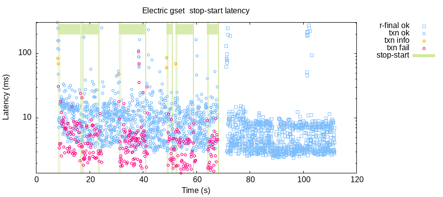
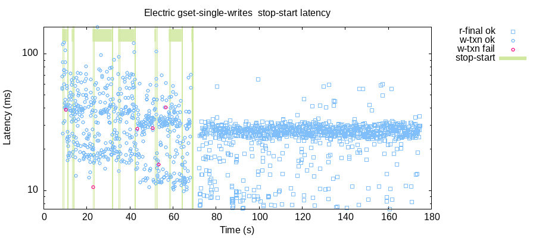

### Testing ElectricSQL

```sql
-- grow only set
CREATE TABLE gset (id integer PRIMARY KEY, k integer, v integer);
ALTER TABLE gset ENABLE ELECTRIC;

-- last write wins register
CREATE TABLE lww_register (k integer PRIMARY KEY, v integer);
ALTER TABLE lww_register ENABLE ELECTRIC;
```

Random transactions are generated:

```clj
[[:w 6 1] [:r 9 nil] [:w 7 1]]
```

And executed as SQL transactions on random nodes:

```sql
-- gset
BEGIN;
  SELECT k,v FROM gset WHERE k = ?;
  INSERT INTO gset (id,k,v) VALUES(?, ?, ?);
END;

-- lww register
BEGIN;
  SELECT k,v FROM lww_register WHERE k = ?;
  INSERT INTO lww_register (k,v) VALUES(?, ?) ON CONFLICT(k) DO UPDATE SET v = ?;
END;

```

----

### Clients

Clients are total sticky available, always interact with:
  - same node
  - same database connection

Heterogeneous:
  - SQLite3
    - ElectricSQL TypeScript 
    - better-sqlite3 TypeScript
    - SQLite3 cli
  - PostgreSQL jdbc driver

Simple/Transparent
  - always rollback on error
  - no retries

### Servers

PostgreSQL
```sql
ALTER SYSTEM SET wal_level = logical;
```

ElectricSQL
```bash
ELECTRIC_WRITE_TO_PG_MODE=direct_writes
```

SQLite3
```ts
conn.pragma('journal_mode = WAL')
```

----

### Public Alpha, Failure Modes

> ElectricSQL is in public alpha phase.
>
> Currently, you may experience bugs or behaviour that leads to an inconsistent data state. This is not related to the core consistency model. It's a consequence of the lack of validation and some recovery modes still pending implementation.
>
> In development, you can usually recover from these bugs by resetting your database(s).
>
>   -- ElectricSQL [roadmap](https://electric-sql.com/docs/reference/roadmap), [failure modes](https://electric-sql.com/docs/reference/roadmap#failure-modes)

The test results below reflect an alpha release and show failure modes:
  - at relatively low transaction rates
  - over relatively short periods of time
  - when going online/offline
  - using active/active sync

----

### TypeScript API Limitations

ElectricSQL is active/active for PostgreSQL and 1 to many heterogenous SQLite3 clients.

We would like to test heterogenous clients doing transactions with a mixture of reads and writes.

#### ElectricSQL TypeScript API
  - only supports homogeneous transactions, i.e. all reads or all writes vs mixed read/write transactions
  - only supports multiple record create or update, not upsert

So tests that use an ElectricSQL TypeScript API client
  - must use homogeneous transactions
  - can only have a single write in the transaction when upsert'ing

----

### Active/Active (PostgreSQL/SQLite3) Sync Deadlocks

#### Workload:
  - LWW Register
  - 2 PostgreSQL jdbc clients
  - 2 better-sqlite3 TypeScript clients
  - transactions a random mix of reads/writes

#### Deadlock in replication service writes leads to ok'd SQLite3 client writes not being stored in PostgreSQL or replicated to other SQLite3 clients

On node n3, the SQLite3 client does an ok write of [5 121]:
```clj
{:index 3637, :type :ok, :f :txn, :value [[:r 6 224] [:r 20 3] [:w 5 121] [:w 18 171]], :node "n3"}
```

The ElectricSQL replication satellite on node n3 replicates [5 121]:
```log
[proto] send: #SatOpLog{ops: ... new: ["5", "121"], old: data: ["5", "111"] ...}
...
```

ElectricSQL replication PL/pgSQL function for the electrified PostgreSQL table fails with a deadlock:
```log
ERROR:  deadlock detected
DETAIL:  Process 182 waits for ShareLock on transaction 2174; blocked by process 225.
	Process 225 waits for ShareLock on transaction 2172; blocked by process 182.
	Process 182: INSERT INTO "public"."lww_register"("k","v") VALUES (5,121)
	Process 225: INSERT INTO lww_register (k,v) VALUES (20,256) ON CONFLICT(k) DO UPDATE SET v = 256
...
	PL/pgSQL function electric.reorder_main_op___public__lww_register() line 12 at SQL statement
STATEMENT:  INSERT INTO "public"."lww_register"("k","v") VALUES (5,121)
```

PostgreSQL deadlock causes error in ElectricSQL sync service:
```log
[error] GenServer #PID<0.2820.0> terminating
** (RuntimeError) Postgres.Writer failed to execute statement INSERT INTO "public"."lww_register"("k","v") VALUES (5,121) with error {:error, {:error, :error, "40P01", :deadlock_detected, "deadlock detected"...}}
  (electric 0.9.0) lib/electric/replication/postgres/writer.ex:93: anonymous fn/2 in Electric.Replication.Postgres.Writer.send_transaction/3
...
```
Write appears to not be retried and are not observed by any PostgreSQL clients or the other SQLite3 client. 

This is straightforward to reproduce.

Conclusion, cannot active/active PostgreSQL/SQLite3 with transactions that update/upsert 
([issue](https://github.com/electric-sql/electric/issues/919)).

Test command:
```bash
lein run test --workload lww-register --nodes n1,n2,n3,n4 --postgresql-nodes n1,n2 --better-sqlite3-nodes n3,n4 --min-txn-length 4 --max-txn-length 4
```

----

### Active/Active (PostgreSQL/SQLite3) Non-Atomic Replication

#### Workload
  - GSet
  - 2 PostgreSQL jdbc clients
  - 8 better-sqlite3 TypeScript clients
  - 20 tps
  - transactions a random mix of reads/writes

#### SQLite3 Client Writes Observed by PostgreSQL Client Reads Non-Atomically

SQLite3 Client Writes:
```clj
{:index 14859, :type :ok, :process 5, :f :txn,
 :value [[:w 4 147] [:w 41 104] [:w 43 26] [:w 43 27]], :node "n6"}
```

PostgreSQL Client Reads:
```clj
;; reads skips over one write but do read the last two writes
{:index 14872, :type :ok, :process 0, :f :txn,
 :value [[:r 41 #{1...103 107}] [:r 43 #{1...27}]], :node "n1"}

;; and later does read the previously omitted writes
{:index 14915, :type :ok, :process 0, :f :txn,
 :value [[:w 37 151] [:w 43 41] [:r 41 #{1...117}] [:w 41 118]], :node "n1"}
```

Formally:
```
G-single-item
Let:
  T1 = {:index 14872, :type :ok, :process 0, :f :txn,
        :value [[:r 41 #{1...103 107}] [:r 43 #{1...27}]], :node "n1"}
  T2 = {:index 14859, :type :ok, :process 5, :f :txn,
        :value [[:w 4 147] [:w 41 104] [:w 43 26] [:w 43 27]], :node "n6"}

Then:
  - T1 < T2, because T1's read of [41 #{1...103 107}] did not observe T2's write of [41 104] (r->w).
  - However, T2 < T1, because T2's write of [43 27] was read by T1 (w->r): a contradiction!
```


GitHub [issue](https://github.com/electric-sql/electric/issues/1112).

Test command:
```bash
lein run test --workload gset --nodes n1,n2,n3,n4,n5,n6,n7,n8,n9,n10 --postgresql-nodes n1,n2 --better-sqlite3-nodes n3,n4,n5,n6,n7,n8,n9,n10 --rate 20 --time-limit 600
```

----

### Normal Operation and Strong Convergence

#### Workload:
  - gset
  - 10tps
  - each transaction is a single write operation
  - 10 ElectricSQL TypeScript client nodes
  - for 600s

#### Invalid Strong Convergence

Node n1 writes [1 50]:
```clj
{:index 42, :type :ok, :f :w-txn, :value [[:w 50 1]], :node "n1"}
```

n1 sends replication message which is received by all other nodes
```log
# n1
[proto] send: #SatOpLog{ ... new: ["500001", "50", "1"] ... }

# n2-n10
[proto] recv: #SatOpLog{ ... new: ["500001", "50", "1"] ... }
```

Yet only node n1 reads [1 50]:
```clj
{:strong-convergence
  {:valid? false,
   :expected-read-count 5955,
   :incomplete-final-reads {"n2" {:missing-count 47,
                                  :missing {1 {50 "n1",
                                               52 "n1",
                                               53 "n1"},
                                            4 {53 "n1"},
                                            7 {52 "n1",
                                               53 "n1",
                                               55 "n1"},
                                            ...}},
                            "n3" {:missing-count 47,
                                  :missing {1 {50 "n1",
                                               52 "n1",
                                               53 "n1"},
                                            4 {53 "n1"},
                                            7 {52 "n1",
                                               53 "n1",
                                               55 "n1"},
                                            ...}}
                            ...}}}
```

In total, 47 of node n1's writes were not replicated.

ElectricSQL sync service logs:
```log
# 10+ occurrences
[error] GenStage consumer #PID<0.3290.0> received $gen_producer message: {:"$gen_producer", {#PID<0.3290.0>, #Reference<0.2906289151.3705143304.108196>},
  {:ask, 500}}
...
```

#### @ 100tps for 30s ~25% of all writes not replicated, no errors in any logs

Test command:
```bash
lein run test --workload gset-single-writes --nodes n1,n2,n3,n4,n5,n6,n7,n8,n9,n10 --electricsql-nodes n1,n2,n3,n4,n5,n6,n7,n8,n9,n10 --rate 10 --time-limit 600
```

----

### Stopping/Starting Clients Can Lose Writes

#### Workload:
  - gset
  - 25tps, mixture of reads and writes
  - 10 better-sqlite3 TypeScript client nodes
  - for 60s

#### Stop/Start Clients
  - ~5s cleanly stop a random minority-third of the clients
    - no transactions against the local SQLite3 db are done while stopped
  - ~5s restart clients
    - resync local SQLite3 db
    - resume performing local transactions

```clj
:nemesis :info :stop-node :minority-third
:nemesis :info :stop-node {"n6" :stopped, "n8" :stopped, "n10" :stopped}
...
:nemesis :info :start-node nil
:nemesis :info :start-node {"n1" :already-running, ..., "n6" :started, ...}
```
Client log:
```log
[electricsql]: stop request received.
[electricsql]: ElectricSQL closed.
[electricsql]: DB conn closed.
Jepsen starting  /usr/bin/npm run start
...
starting replication with lsn: ...
[rpc] send: #SatInStartReplicationReq...
[proto] send: #SatRpcRequest{method: startReplication, requestId: 2}
[proto] recv: #SatRpcResponse{method: startReplication, requestId: 2}
...
```

You can see Jepsen fail to connect to the client to do a transaction when the client is stopped:



#### Invalid Strong Convergence

Node n5 writes [5 20]:
```clj
{:index 1173, :type :ok, :f :txn, :value [[:r 10 #{2 3 4 ...}] [:r 6 #{1 2 3 ...}] [:w 5 20]], :node "n5"}
```

n5 sends replication message which is replicated to node n1
```log
# n5
[proto] send: #SatOpLog{... new: ["50020", "5", "20"] ...}

# n1
[proto] recv: #SatOpLog{... new: ["50020", "5", "20"] ...}
```

Yet node n1 does not read [5 20] on final read:
```clj
{:strong-convergence
 {:valid? false,
  :expected-read-count 1431,
  :incomplete-final-reads {"n1" {:missing-count 1,
                                 :missing {5 {20 "n5"}}}}}}
```

Node n1 appears to lose the write on later stop/start/resync.

No errors in ElectricSQL sync service logs.

Test command:
```bash
lein run test --workload gset --nodes n1,n2,n3,n4,n5,n6,n7,n8,n9,n10 --better-sqlite3-nodes n1,n2,n3,n4,n5,n6,n7,n8,n9,n10 --rate 25 --nemesis stop-start
```

----

### Offline Replication and Strong Convergence

#### Workload:
  - gset
  - 10tps, each transaction a single write
  - 10 SQLite3 CLI client nodes
  - for 60s

#### Stop/Start Clients
  - ~5s cleanly stop a random minority-third of the clients
    - transactions continue against the local SQLite3 db
  - ~5s restart clients
    - resync local SQLite3 db

You can see Jepsen continue to perform offline reads/writes when the client is stopped:



#### Invalid Strong Convergence

7 out of 10 nodes are missing replicated writes:
```clj
{:strong-convergence
 {:valid? false,
  :expected-read-count 646,
  :incomplete-final-reads {"n1" {:missing-count 1,
                                 :missing {51 {6 "n2"}}},
                           "n10" {:missing-count 1,
                                  :missing {10 {4 "n7"}}},
                           "n3" {:missing-count 1,
                                 :missing {90 {1 "n10"}}},
                           "n4" {:missing-count 1,
                                 :missing {10 {4 "n7"}}},
                           "n5" {:missing-count 1,
                                 :missing {71 {2 "n4"}}},
                           "n6" {:missing-count 1,
                                 :missing {10 {4 "n7"}}},
                           "n7" {:missing-count 1,
                                 :missing {39 {5 "n1"}}}}}}
```

No errors in ElectricSQL sync service logs.

Test command:
```bash
lein run test --workload gset-single-writes --nodes n1,n2,n3,n4,n5,n6,n7,n8,n9,n10 --sqlite3-cli-nodes n1,n2,n3,n4,n5,n6,n7,n8,n9,n10 --rate 10 --nemesis stop-start
```

----

### Local DB Resets and Strong Convergence

#### Workload:
  - gset
  - 100tps, mixture of reads and writes
  - 10 better-sqlite3 TypeScript client nodes
  - for 60s

#### Local Db Resets
  - ~10s reset a minority-third of the local client dbs
    - stop client
    - remove local SQLite3 db
    - start client
    - sync local db
    - resume performing transactions
  - at the end of the test
    - before final reads
    - reset all clients

```clj
:nemesis :info :reset-db :minority-third
:nemesis :info :reset-db {"n3" :reset-db,  "n6" :reset-db, "n7" :reset-db}
```

Client log:
```log
[electricsql]: stop request received.
[electricsql]: ElectricSQL closed.
[electricsql]: DB conn closed.
Jepsen starting  /usr/bin/npm run start
...
no lsn retrieved from store
connecting to electric server
...
no previous LSN, start replication from scratch
...
```

#### Invalid Strong Convergence

```clj
{:strong-convergence
 {:valid? false,
  :expected-read-count 5754,
  :incomplete-final-reads {"n1" {:missing-count 1016,
                                 :missing {1 {10 "n2",
                                              11 "n7",
                                              12 "n2"},
                                           2 {19 "n3",
                                              ...}
                                           ...}}
                           ...}}}
```

All nodes are missing ~20% of writes.

No errors in ElectricSQL sync service logs.

Test command:
```bash
lein run test --workload gset --nodes n1,n2,n3,n4,n5,n6,n7,n8,n9,n10 --better-sqlite3-nodes n1,n2,n3,n4,n5,n6,n7,n8,n9,n10 --nemesis reset-db --nemesis-interval 10
```

----

### Client Sync Kills and Strong Convergence

#### Workload:
  - gset
  - 10tps, each transaction a single write
  - 5 SQLite3 CLI client nodes
  - for 60s

#### Client Sync Service Kills
  - ~5s kill a single node's client sync service
  - ~5s restart node's client
  - perform transactions throughout

```clj
:nemesis :info :kill :minority-third
:nemesis :info :kill {"n1" :killed}
...
:nemesis :info :start :all
:nemesis :info :start {"n1" :started, "n2" :already-running, ...}
```

#### Invalid Strong Convergence

```clj
{:strong-convergence
 {:valid? false,
  :expected-read-count 613,
  :incomplete-final-reads {"n1" {:missing-count 1,
                                 :missing {80 {1 "n5"}}},
                           "n4" {:missing-count 1,
                                 :missing {6 {2 "n2"}}},
                           "n5" {:missing-count 1,
                                 :missing {34 {4 "n1"}}}}}
```

Majority of nodes missing a write.

No errors in ElectricSQL or client sync service logs.

Test command:
```bash
lein run test --workload gset-single-writes --nodes n1,n2,n3,n4,n5 --sqlite3-cli-nodes n1,n2,n3,n4,n5 --nemesis kill --rate 10 --time-limit 60
```
