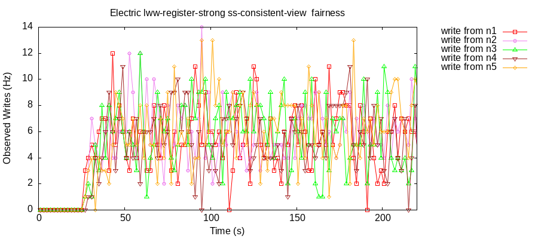

### Testing ElectricSQL

#### LWW Register

```sql
CREATE TABLE lww_registers (k integer PRIMARY KEY, v integer);
ALTER TABLE lww_registers ENABLE ELECTRIC;
```

Random transactions are generated:

```clj
[[:w 6 1] [:r 9 nil] [:w 7 1]]
```

And executed as SQL transactions on random nodes:

```sql

BEGIN;
  -- [:r k v]
  SELECT k,v FROM lww_registers WHERE k = ?;
  -- [:w k v]
  INSERT INTO lww_registers(k,v) VALUES(?, ?) ON CONFLICT(k) DO UPDATE SET v = ?;
END;
```

----

### Clients

Clients are sticky, always:
  - talks to same node
  - uses same connection

Heterogeneous:
  - SQLite3 CLI
  - PostgreSQL jdbc driver

----

### Strong Convergence

- generate a random mixture of reads and writes across all clients
- let database briefly quiesce
- each client does a final read of all keys in a single transaction from each node

Check:

  - all nodes have an ok read
    - total sticky availability
  - all nodes read the same value for all keys
    - strong convergence

----

### Fault Injection

Jepsen faults are real faults:

  - kill (-9) the ElectricSQL satellite sync service on each node
    - clients continue to read/write to the database
    - sync service restarted

----

### ***Preliminary*** Testing of Fairness

Check the rate at which each node's writes are being read across the cluster.
E.g. are my document edits, puzzle solving moves, inventory control edits, etc. being fairly represented in reads across the cluster.

5 SQLite3 clients do transactions with a random mix of reads/writes against random keys, write values are sequential per key:
```clj
5	:ok	:txn	[[:r 29 8] [:w 7 13]]
2	:ok	:txn	[[:w 3 10] [:r 83 11]]
3	:ok	:txn	[[:w 56 7] [:r 53 10]]
4	:ok	:txn	[[:w 88 13] [:w 10 13]]
...
```

Always check for strong convergence at the end of the test, final reads available and == on each node:
```clj
:strong-convergence {:valid? true,
                     :final-read {0 92,
                                  1 89,
                                  2 99,
                                  ...
                                  97 108,
                                  98 87,
                                  99 90}}
```

Total each node's writes that were read:
```clj
:fairness {:valid? true,
           :reads-of-writes {"n1" 1317,
                             "n2" 1289,
                             "n3" 1289,
                             "n4" 1320,
                             "n5" 1284}}
```

And for every read, plot which node wrote the value:



It's a gross measurement, and you can see the random ebb and flow, but it shows relative fairness of each node's writes being read.

```bash
lein run test --nodes postgresql,electricsql,n1,n2,n3,n4,n5 --noop-nodes postgresql,electricsql --workload lww-register-strong --time-limit 200 --key-dist uniform --key-count 100 --max-writes-per-key 1000 --min-txn-length 2 --max-txn-length 2 --rate 50
```

----

### ***Preliminary*** Testing of Strong Convergence With Kills

- 10 SQLite3 client nodes
- ~50 tps

```clj
;; ~5s kill the Electric sync service on a random third of the nodes
:nemesis	:info	:kill	["n1" "n4" "n6"]
:nemesis	:info	:kill	{"n1" :killed, "n4" :killed, "n6" :killed}

;; keep doing local transactions even with no sync service
7	:ok	:txn	[[:w 9 12] [:r 8 6] [:r 9 12]]
9	:ok	:txn	[[:w 9 13] [:r 9 13]]
10	:ok	:txn	[[:w 8 15] [:r 9 6] [:r 8 15] [:w 4 1]]
11	:ok	:txn	[[:r 9 7] [:w 8 16]]
3	:ok	:txn	[[:r 9 10] [:w 9 17] [:r 6 nil]]
4	:ok	:txn	[[:w 8 19] [:w 9 18] [:w 6 2] [:w 6 3]]
6	:ok	:txn	[[:r 4 nil] [:r 9 nil]]

;; ~5s restart sync service on nodes forcing it to catch-up with local and remote writes,
;; and hopefully forcing it to deal with timing/recovery of sync in progress kills 😈 
:nemesis	:info	:start	:all
:nemesis	:info	:start	{"n1" :started, "n2" :already-running, "n3" :already-running, "n4" :started, ...}
```


```clj
;; strong convergence
{:valid? true,
 :final-read {0 6,
              1 12,
              2 23,
              3 56,
              4 91,
              5 171,
              6 254,
              7 247,
              8 251,
              9 256,
              ...}}
```
