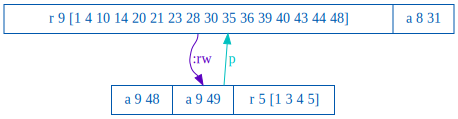
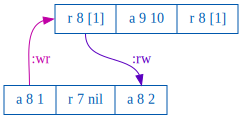

### Testing ElectricSQL

```sql
-- last write wins list-append register
CREATE TABLE IF NOT EXISTS lww (
  k INTEGER PRIMARY KEY,
  v TEXT
);

-- electrify table
ALTER TABLE lww ENABLE ELECTRIC;
```

Random transactions are generated:

```clj
[[:append 9 73] [:r 8 [3 5 6 8 10 15 17 22 24 25 28 30]] [:append 7 18]]
```

And executed as SQL transactions on random nodes:

```sql
BEGIN;
  SELECT k,v FROM lww WHERE k = ?;
  INSERT INTO lww (k,v) VALUES(?, ?) ON CONFLICT(k) DO UPDATE SET v = v || ' ' || ?;
END;

```

----

### Clients

Clients are total sticky available, always interact with:
  - same node
  - same database connection

Use SQL drivers:
  - SQLite3: better-sqlite3
  - PostgreSQL: jdbc

Simple/Transparent
  - always rollback on error
  - no retries

### Servers

PostgreSQL
```sql
ALTER SYSTEM SET wal_level = logical;
```

ElectricSQL
```bash
ELECTRIC_WRITE_TO_PG_MODE=direct_writes
```

SQLite3
```ts
conn.pragma('journal_mode = WAL')
```

----

### Public Alpha, Failure Modes

> ElectricSQL is in public alpha phase.
>
> Currently, you may experience bugs or behaviour that leads to an inconsistent data state. This is not related to the core consistency model. It's a consequence of the lack of validation and some recovery modes still pending implementation.
>
> In development, you can usually recover from these bugs by resetting your database(s).
>
>   -- ElectricSQL [roadmap](https://electric-sql.com/docs/reference/roadmap), [failure modes](https://electric-sql.com/docs/reference/roadmap#failure-modes)

Initial testing of ElectricSQL reflects the alpha phase:
  - active/active deadlock with data loss
  - clients can fail to read their own writes with data loss
  - non-atomic transactions
  - divergent final state between clients without strong converge
  - going offline, online, can make clients unresponsive

----

### Active/Active (PostgreSQL/SQLite3) Sync Deadlocks

#### Workload:
  - LWW Register
  - 2 PostgreSQL jdbc clients
  - 2 better-sqlite3 TypeScript clients
  - transactions a random mix of reads/writes

#### Deadlock in replication service writes leads to ok'd SQLite3 client writes not being stored in PostgreSQL or replicated to other SQLite3 clients

On node n3, the SQLite3 client does an ok write of [5 121]:
```clj
{:index 3637, :type :ok, :f :txn, :value [[:r 6 224] [:r 20 3] [:w 5 121] [:w 18 171]], :node "n3"}
```

The ElectricSQL replication satellite on node n3 replicates [5 121]:
```log
[proto] send: #SatOpLog{ops: ... new: ["5", "121"], old: data: ["5", "111"] ...}
...
```

ElectricSQL replication PL/pgSQL function for the electrified PostgreSQL table fails with a deadlock:
```log
ERROR:  deadlock detected
DETAIL:  Process 182 waits for ShareLock on transaction 2174; blocked by process 225.
	Process 225 waits for ShareLock on transaction 2172; blocked by process 182.
	Process 182: INSERT INTO "public"."lww_register"("k","v") VALUES (5,121)
	Process 225: INSERT INTO lww_register (k,v) VALUES (20,256) ON CONFLICT(k) DO UPDATE SET v = 256
...
	PL/pgSQL function electric.reorder_main_op___public__lww_register() line 12 at SQL statement
STATEMENT:  INSERT INTO "public"."lww_register"("k","v") VALUES (5,121)
```

PostgreSQL deadlock causes error in ElectricSQL sync service:
```log
[error] GenServer #PID<0.2820.0> terminating
** (RuntimeError) Postgres.Writer failed to execute statement INSERT INTO "public"."lww_register"("k","v") VALUES (5,121) with error {:error, {:error, :error, "40P01", :deadlock_detected, "deadlock detected"...}}
  (electric 0.9.0) lib/electric/replication/postgres/writer.ex:93: anonymous fn/2 in Electric.Replication.Postgres.Writer.send_transaction/3
...
```
Write appears to not be retried and are not observed by any PostgreSQL clients or the other SQLite3 client. 

This is straightforward to reproduce.

Conclusion, cannot active/active PostgreSQL/SQLite3 with transactions that update/upsert 
([issue](https://github.com/electric-sql/electric/issues/919)).

----

### Failure to Read Your Writes / Lost Writes

#### Workload:
  - lww
  - 5 better-sqlite3 client nodes
  - 10tps for 30s

#### Unread Write in Process is Lost
- n5 writes [9 48] and [9 49]
- n5 only reads [9 48]
- [9 49] is never observed in any reads on any clients

```clj
{:node "n5" :index 175
 :value [[:append 9 48] [:append 9 49] [:r 5 [1 3 4 5]]]}
 {:node "n5" :index 187
  :value [[:r 9 [1 4 10 14 20 21 23 28 30 35 36 39 40 43 44 48]] [:append 8 31]]}
```



Test command:
```bash
lein run test --workload lww-causal+strong --rate 10 --time-limit 30
```

----

### Non-Atomic Transactions

#### Workload:
  - lww
  - 5 better-sqlite3 client nodes
  - 10tps for 30s

#### Not Monotonic Atomic View
- n4 writes [8 1] and [8 2]
- n2 then reads only [8 1]
- n2, and other nodes, ultimately read both [8 1] and [8 2] 

```clj
{:node "n4" :index 13
 :value [[:append 8 1] [:r 7 nil] [:append 8 2]]}
{:node "n2" :index 37
 :value [[:r 8 [1]] [:append 9 10] [:r 8 [1]]]}
...
{:node "n2" :index 97
 :value [[:r 8 [1 2 8 12 14 17]] [:append 8 20]]}
```



Test command:
```bash
lein run test --workload lww-causal+strong --rate 10 --time-limit 30
```

----

### Divergent Final Reads

#### Workload:
  - lww
  - 10 better-sqlite3 client nodes
  - 100tps for 300s

Node n1 goes it's own way and ends up with multiple divergent final reads,
nodes n2-n10 all strongly converge.

```clj
{:strong-convergence
 {:valid? false
  :divergent-reads {82 {[4 ... 157 167 183 204 212 243 244 253 254]
                        #{"n2" ... "n10"}
                        
                        [4 ... 157 162 163 168 174 181 182 193 ... 256]
                        #{"n1"}}}
```

Test command:
```bash
lein run test --workload lww-convergence --nodes n1,n2,n3,n4,n5,n6,n7,n8,n9,n10 --time-limit 200
```

----

### Offline/Online Fragility

#### Workload:
  - lww
  - 5 better-sqlite3 client nodes
  - 10tps for 30s
  - ~5s a random minority-third of nodes are taken offline, then brought back online 

#### Going Offline Killing the Sync Satellite

Node n4 is taken offline and becomes unresponsive as a result.

```clj
:nemesis	:info	:offline	:minority-third
:nemesis	:info	:offline	{"n4" :offline}
...
"n4"	:invoke	:txn	[[:append 8 87]]
"n4"	:fail	:txn	[[:append 8 87]]	:connection-refused
```

Errors in log:
```clj
:logs-client {:valid? false,
              :count 2,
              :matches ({:node "n4",
                         :line "      throw new SatelliteError("}
                        {:node "n4",
                         :line "SatelliteError: sending a transaction while outbound replication has not started"})}
```

Test command:
```bash
lein run test --workload lww-causal+strong --rate 10 --time-limit 30 --nemesis offline-online
```
