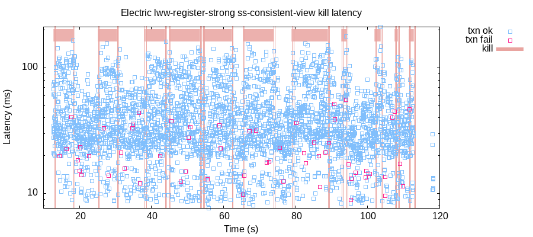

### Testing ElectricSQL

#### LWW Register

```sql
CREATE TABLE lww_registers (k integer PRIMARY KEY, v integer);
ALTER TABLE lww_registers ENABLE ELECTRIC;
```

Random transactions are generated:

```clj
[[:w 6 1] [:r 9 nil] [:w 7 1]]
```

And executed as SQL transactions on random nodes:

```sql

BEGIN;
  -- [:r k v]
  SELECT k,v FROM lww_registers WHERE k = ?;
  -- [:w k v]
  INSERT INTO lww_registers(k,v) VALUES(?, ?) ON CONFLICT(k) DO UPDATE SET v = ?;
END;
```

----

#### Clients

Clients are sticky, always:
  - talks to same node
  - uses same connection

Heterogeneous:
  - SQLite3 CLI
  - PostgreSQL jdbc driver

----

### Strong Convergence

- generate a random mixture of reads and writes across all clients
- let database briefly quiesce
- each client does a final read of all keys in a single transaction from each node

Check:

  - all nodes have an ok read
    - total sticky availability
  - all nodes read the same value for all keys
    - strong convergence

----

### Fault Injection

Jepsen faults are real faults:

  - kill (-9) the ElectricSQL satellite sync service on each node
    - clients continue to read/write to the database
    - sync service restarted

----

### ***Preliminary*** Testing of Strong Convergence With Kills

- 10 SQLite3 client nodes
- ~50 tps

```clj
;; ~5s kill the Electric sync service on a random third of the nodes
:nemesis	:info	:kill	["n1" "n4" "n6"]
:nemesis	:info	:kill	{"n1" :killed, "n4" :killed, "n6" :killed}

;; keep doing local transactions even with no sync service
7	:ok	:txn	[[:w 9 12] [:r 8 6] [:r 9 12]]
9	:ok	:txn	[[:w 9 13] [:r 9 13]]
10	:ok	:txn	[[:w 8 15] [:r 9 6] [:r 8 15] [:w 4 1]]
11	:ok	:txn	[[:r 9 7] [:w 8 16]]
3	:ok	:txn	[[:r 9 10] [:w 9 17] [:r 6 nil]]
4	:ok	:txn	[[:w 8 19] [:w 9 18] [:w 6 2] [:w 6 3]]
6	:ok	:txn	[[:r 4 nil] [:r 9 nil]]

;; ~5s restart sync service on nodes forcing it to catch-up with local and remote writes,
;; and hopefully forcing it to deal with timing/recovery of sync in progress kills 😈 
:nemesis	:info	:start	:all
:nemesis	:info	:start	{"n1" :started, "n2" :already-running, "n3" :already-running, "n4" :started, ...}
```



```clj
;; strong convergence
{:valid? true,
 :final-read {0 6,
              1 12,
              2 23,
              3 56,
              4 91,
              5 171,
              6 254,
              7 247,
              8 251,
              9 256,
              ...}}
```
